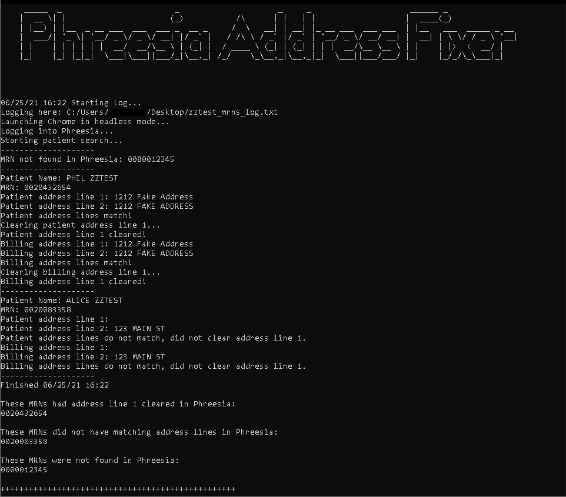

# Phreesia Address Fixer


[![LinkedIn][linkedin-shield]][linkedin-url]


<!-- ABOUT THE PROJECT -->
## About The Project

We are having an issues where patients' addresses are being duplicated in address line 1 (the optional/apartment address line). We are working with Phreesia directly on a possible solution, but feel a big contributor is user (patient) error. This script will take a list of MRNs, search for them in Phreesia, do a check to see if address line 1 and address line 2 match (for both patient and guarantor), and if they match, clear address line 1.


### Built With

* [Selenium with Python](https://selenium-python.readthedocs.io/index.html)


### Prerequisites

* Selenium
  ```sh
  pip install selenium
  ```
* An appropriate web driver
  * See the [web driver documentation](https://www.selenium.dev/documentation/en/webdriver/driver_requirements/) for details.

### Usage

1. Set enviornment variables for PHREESIA_USERNAME and PHREESIA_PASSWORD. These are called in the script but could easily be motified to accept user input. 
  ``` python
  PHREESIA_USERNAME = os.environ.get('PHREESIA_USERNAME')
  PHREESIA_PASSWORD = os.environ.get('PHREESIA_PASSWORD')
  ```
2. Get a list of MRNs to evaluate. Have them in a .txt file with one MRN per line.
3. When launching the program, a File Selector window will open. Select the .txt file containing the MRNs.

### Project Screenshot

<p align="left">
  <a href="https://github.com/phil-huxford/Phreesia-Address-Fixer">
    
  </a>
</p>

 
## Contact

Phil Huxford - [![LinkedIn][linkedin-shield]][linkedin-url]

Project Link: [https://github.com/phil-huxford/Phreesia-Address-Fixer](https://github.com/phil-huxford/Phreesia-Address-Fixer)


[linkedin-shield]: https://img.shields.io/badge/-LinkedIn-black.svg?style=for-the-badge&logo=linkedin&colorB=555
[linkedin-url]: https://www.linkedin.com/in/phillip-huxford/
